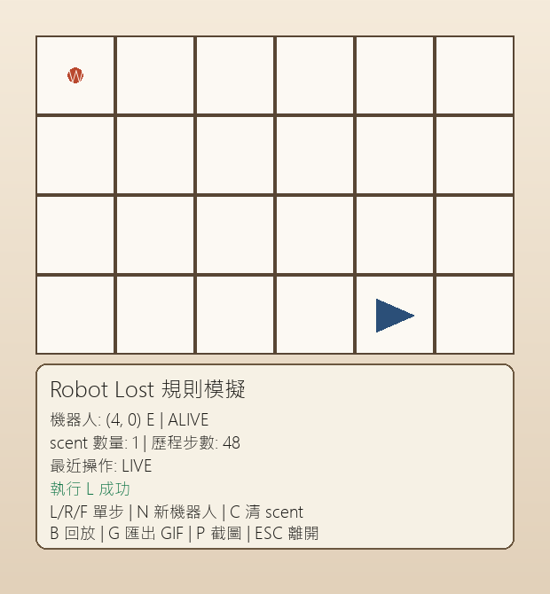

# Week 03 - Robot Lost（pygame 規則模擬 + 視覺化）



## 1) 功能清單

- 顯示格子地圖（座標 0..W, 0..H）
- 顯示機器人位置與朝向（三角形）
- 顯示 scent（圓點 + 方向字母）
- 鍵盤 `L / R / F` 單步執行
- `N` 建立新機器人（保留 scent）
- `C` 清除 scent
- `B` 啟用/關閉回放模式
- `G` 匯出 `assets/replay.gif`（需 Pillow）
- `P` 立即儲存目前畫面到 `assets/gameplay.png`
- HUD 顯示狀態（ALIVE/LOST、步數、訊息）

## 2) 執行方式

### 環境需求

- Python 3.11 ~ 3.12（建議；pygame 相容性較穩定）
- pygame 2.x
- Pillow（僅 GIF 匯出需要）

### 安裝

```bash
pip install pygame Pillow
```

### 啟動遊戲

```bash
python robot_game.py
```

## 3) 測試方式

執行：

```bash
python -m unittest discover -s tests -p "test_*.py" -v
```

結果摘要：

- 測試總數：11
- 通過：11
- 失敗：0

## 4) 資料結構選擇理由（至少 3 點）

1. `RobotState` 用 dataclass：
   - 將 `(x, y, direction, lost)` 打包成不可變狀態，減少共享狀態誤改風險。
2. `set[tuple[int, int, str]]` 存 scent：
   - 查找為平均 O(1)，非常適合每次 `F` 前快速判斷是否該忽略危險步。
3. `MOVE_TABLE` 字典：
   - 方向到位移 `(dx, dy)` 的映射清楚可擴充，避免大量 `if/elif`。
4. `frames: list[FrameState]`：
   - 回放與 GIF 匯出都可直接重建每步畫面，資料流簡單。

## 5) 我踩到的一個 bug 與修正

- 問題：回放模式下 HUD 的 scent 數量曾顯示成「目前 live scent」，不是該 frame 的 scent。
- 修正：將 `_draw_hud()` 改為接收 `scents` 參數，改用 frame 對應的資料繪製，回放與匯出畫面一致。

## 6) 操作說明

- `L`：左轉
- `R`：右轉
- `F`：前進
- `N`：新機器人（保留 scent）
- `C`：清空 scent
- `B`：回放
- `G`：匯出 GIF
- `P`：截圖（儲存 `assets/gameplay.png`）
- `ESC`：離開

## 7) 重播方式說明

### 即時回放（內建）

1. 先用 `L/R/F` 累積若干步。
2. 按 `B` 進入回放模式。
3. 再按一次 `B` 可回到即時模式。

### 匯出 GIF

1. 確認已安裝 Pillow：`pip install Pillow`
2. 遊戲內按 `G`
3. 會輸出到 `assets/replay.gif`
4. 用瀏覽器或圖片檢視器開啟 `assets/replay.gif`

## 8) 核心規則口頭說明重點

- 為什麼 scent 要記錄方向：
  - 同一格子，朝向不同時「前進後會不會掉落」可能不同，所以必須記 `(x, y, dir)`，不能只記 `(x, y)`。
- 為什麼 LOST 後要停止：
  - 題目規則就是「掉落後該機器人結束任務」，後續指令不再有意義，且可避免狀態污染。

## 9) TDD 與測試覆蓋對照

### Red → Green → Refactor

1. Red：先建立測試檔，執行後因 `robot_core.py` 尚未存在而失敗（`ModuleNotFoundError`）。
2. Green：完成最小可行核心邏輯（旋轉、前進、越界、LOST、scent）後，全測試通過。
3. Refactor：調整函式切分與命名，並驗證測試仍全綠。

詳細執行紀錄請見 `TEST_LOG.md`。

### 測試檔與測試數量

- 測試檔案 2 份：
   - `tests/test_robot_core.py`
   - `tests/test_robot_scent.py`
- 測試函式總數：11
- 測試框架：Python 內建 `unittest`
- 測試指令：

```bash
python -m unittest discover -s tests -p "test_*.py" -v
```

### 最低測試清單對應

1. N + L = W → `test_turn_left_from_north_is_west`
2. N + R = E → `test_turn_right_from_north_is_east`
3. 連續 4 次 R 回原方向 → `test_four_right_turns_back_to_original`
4. 邊界往外 F 會 LOST → `test_forward_outside_boundary_becomes_lost`
5. 邊界內移動不會 LOST → `test_forward_inside_boundary_not_lost`
6. 第一台越界後留下 scent → `test_first_robot_leaves_scent_after_lost`
7. 第二台同 (x,y,dir) 會忽略危險 F → `test_second_robot_ignores_dangerous_forward_on_same_scent`
8. 同格但不同方向不該共用 scent → `test_same_cell_different_direction_should_not_share_scent`
9. LOST 後不再執行後續指令 → `test_lost_robot_stops_processing_remaining_commands`
10. 非法指令（X）有明確處理策略 → `test_invalid_command_raises_value_error`

## 10) 規格對照（地圖、規則、互動）

### 地圖與狀態

- 地圖使用矩形格子，合法範圍為 (0, 0) 到 (W, H) 且包含邊界。
- 機器人狀態採用 (x, y, dir, lost)。
- dir 僅允許 N、E、S、W。

### 位移表

- N -> (0, +1)
- E -> (+1, 0)
- S -> (0, -1)
- W -> (-1, 0)

### 指令規則

- 玩家輸入指令字元僅允許 L、R、F。
- L：原地左轉 90 度。
- R：原地右轉 90 度。
- F：沿目前方向前進一格。

### LOST 與 scent 規則

- 若執行 F 會離開地圖：
   - 立即標記 LOST。
   - 在「掉落前最後合法位置 + 當前方向」留下一筆 scent。
   - 該機器人停止執行後續指令。
- 後續機器人若位於相同 (x, y, dir) 再遇到同樣越界風險：
   - 忽略該次 F（不移動、不 LOST）。
   - 繼續執行下一個指令。

### scent 資料結構

- 使用 set[tuple[int, int, str]]。
- 例如：(3, 2, 'E')。

### pygame MVP 互動

- 顯示格子地圖。
- 顯示機器人位置與朝向（三角形）。
- 顯示 scent（點 + 方向標記）。
- 支援鍵盤 L/R/F 單步執行。
- 支援 N 建立新機器人（保留 scent）。
- 支援 C 清除 scent。
- 支援回放（B）與輸出 replay.gif（G）。
- 支援 ESC 離開。

### 遊玩截圖要求

- 已在本 README 內嵌 gameplay 圖片：。
- 提交前需確認 assets/gameplay.png 為實際遊玩畫面，且畫面可見地圖、機器人、以及 scent 或 HUD 狀態資訊。
