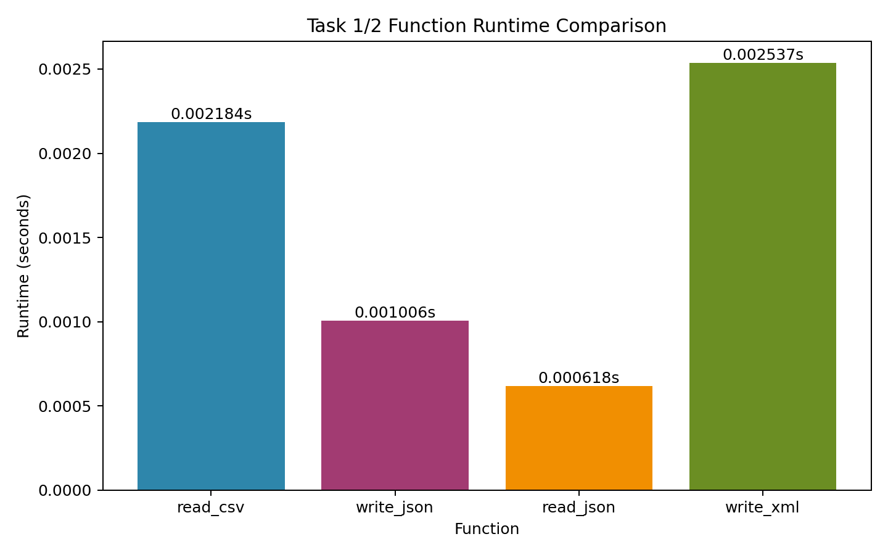

# 📘 Week 10 回家作業：資料格式轉換

> 對應教材：Python3 Cookbook 第六章（資料編碼與處理）
> 本週作業為：**資料格式轉換任務**（Task 1–2）與 **視覺化比較**（Task 3）

---

## 🎯 作業目標

- 熟悉 CSV / JSON / XML 三種格式的讀寫 API
- 理解 Python 裝飾器（decorator）的結構與用途
- 用 `@timeit` 量測自己程式的執行效能，並能解讀結果
- 練習將真實資料（NPU 學生資料）跨格式轉換與輸出
- 以 Test-Driven Development（TDD）流程完成 Task 1 與 Task 2
- 練習用 `matplotlib` / `seaborn` 做效能比較圖

---

## 📁 提交結構

請在 `weeks/week-10/solutions/<student-id>/` 建立以下檔案：

```text
weeks/week-10/solutions/<student-id>/
├── task1_csv_to_json.py        # CSV 讀取 + 統計 + 輸出 JSON
├── task2_json_to_xml.py        # 讀取 JSON + 輸出 XML
├── task3_plot_comparison.py    # 讀取 timeit 結果並繪製比較圖
├── output/                     # 程式輸出（勿手動建立，由程式自動產生）
│   ├── students.json
│   └── students.xml
│   └── timing_comparison.png
├── tests/
│   ├── test_task1.py
│   └── test_task2.py
├── TIMING_REPORT.md            # @timeit 執行結果紀錄
├── TEST_LOG.md                 # TDD Red → Green 執行紀錄（必交）
├── AI_USAGE.md
└── README.md
```

### AI 使用原則

- 可使用 AI 協助理解 API 用法或產生程式草稿
- 不可直接貼上 AI 結果後不驗證就提交
- 你必須能解釋每段程式的邏輯，包括裝飾器的運作方式

---

## 📚 資料來源

本作業使用 **Week 08 的 NPU 學生資料**，路徑為：

```text
weeks/week-08/in-class/stu-data/113年新生資料庫.csv
```

> 注意：CSV 編碼為 **UTF-8-BOM**，讀取時請使用 `encoding='utf-8-sig'`

欄位說明：

| 欄位 | 說明 |
|------|------|
| 學號 | 學生學號 |
| 系所名稱 | 就讀系所 |
| 入學方式 | 繁星推甄 / 個人申請 / 分科測驗 等 |
| 郵遞區號 | 戶籍地郵遞區號 |
| 畢業學校 | 高中名稱 |
| 前畢業科系 | 高中就讀科系 |

---

## 🧪 Test-Driven Development（Task 1 與 Task 2 必做）

本作業的 Task 1、Task 2 須以 **Red → Green → Refactor** 流程進行，並留下執行紀錄。

### 流程說明

```
Red    → 先寫測試，此時程式尚未實作，測試必須失敗
Green  → 撰寫最小可行程式，讓測試通過
Refactor → 整理程式（命名、拆函式、去重複），測試仍全數通過
```

### 實際範例（Task 1）

**Step 1 — Red：先寫測試骨架，函式尚不存在**

```python
# tests/test_task1.py
import unittest
from task1_csv_to_json import filter_by_admission   # 此時尚未實作

class TestTask1(unittest.TestCase):
    def test_filter_keeps_correct_rows(self):
        rows = [
            {"入學方式": "分科測驗", "系所名稱": "資訊系"},
            {"入學方式": "繁星推甄", "系所名稱": "電機系"},
        ]
        result = filter_by_admission(rows, "分科測驗")
        self.assertEqual(len(result), 1)
        self.assertEqual(result[0]["系所名稱"], "資訊系")
```

```bash
$ python -m unittest tests/test_task1.py -v
# ERROR: ImportError: cannot import name 'filter_by_admission'   ← Red ✅
```

**Step 2 — Green：實作最小可行版本**

```python
# task1_csv_to_json.py
def filter_by_admission(rows, method):
    return [r for r in rows if r["入學方式"] == method]
```

```bash
$ python -m unittest tests/test_task1.py -v
# OK (1 test)   ← Green ✅
```

**Step 3 — Refactor：補上型別提示、確認邏輯完整**

```python
def filter_by_admission(rows: list[dict], method: str) -> list[dict]:
    return [r for r in rows if r.get("入學方式") == method]
```

```bash
$ python -m unittest tests/test_task1.py -v
# OK (1 test)   ← 仍全綠 ✅
```

### 測試執行指令

```bash
python -m unittest discover -s tests -p "test_*.py" -v
```

### 測試數量要求

| 檔案 | 最少測試函式數 |
|------|-------------|
| `tests/test_task1.py` | 5 個 |
| `tests/test_task2.py` | 5 個 |
| 合計 | **10 個以上** |

每題至少涵蓋：**正常輸入、邊界情況（空輸入）、錯誤格式或反例** 三種情境。

### TEST_LOG.md 內容要求

請記錄 Task 1 與 Task 2 各至少一次完整的 Red → Green 循環：

```markdown
## Task 1

### Red（失敗紀錄）
執行指令：python -m unittest tests/test_task1.py -v
結果：
  ERROR test_filter_keeps_correct_rows
  ImportError: cannot import name 'filter_by_admission'
  Ran 1 test in 0.001s — FAILED

失敗原因：filter_by_admission 尚未實作

### Green（通過紀錄）
執行指令：python -m unittest tests/test_task1.py -v
結果：
  test_filter_keeps_correct_rows ... ok
  Ran 1 test in 0.002s — OK

讓測試通過的關鍵修改：實作 filter_by_admission，用 list comprehension 過濾入學方式

## Task 2

### Red（失敗紀錄）
...

### Green（通過紀錄）
...
```

---

## ⏱️ 計時裝飾器（必須自行實作）

Task 1 與 Task 2 的核心函式**必須**套上以下裝飾器，不可直接從課堂範例複製，需自行在各自的檔案中重新實作：

```python
import functools
import time

def timeit(func):
    @functools.wraps(func)
    def wrapper(*args, **kwargs):
        start = time.perf_counter()
        result = func(*args, **kwargs)
        elapsed = time.perf_counter() - start
        print(f"[timeit] {func.__name__} 耗時 {elapsed:.6f}s")
        return result
    return wrapper
```

裝飾器需套在：
- `task1_csv_to_json.py` 的 `read_csv()` 與 `write_json()` 函式
- `task2_json_to_xml.py` 的 `read_json()` 與 `write_xml()` 函式

---

## 🔄 Task 1：CSV → JSON 轉換（30 分）

### 任務說明

讀取 `113年新生資料庫.csv`，完成以下三件事：

1. **讀取並過濾**：只保留 `入學方式 == '聯合登記分發'` 的學生
2. **統計**：計算這些學生中各 `系所名稱` 的人數，加入輸出結果
3. **輸出 JSON**：將過濾後的學生清單與統計結果，寫入 `output/students.json`

### 輸出格式

```json
{
  "來源": "113年新生資料庫",
  "入學方式篩選": "聯合登記分發",
  "總人數": 42,
  "系所統計": {
    "電機工程系": 10,
    "資訊工程系": 8,
    "...": "..."
  },
  "學生清單": [
    {
      "學號": "1131234001",
      "系所名稱": "電機工程系",
      "畢業學校": "國立馬公高中",
      "郵遞區號": "880"
    }
  ]
}
```

> 提示：請先檢查 `入學方式` 欄位在資料檔中的實際類別值，再設定篩選字串，避免篩選後結果為 0 筆。

### 函式結構要求

```python
@timeit
def read_csv(filepath: str) -> list[dict]:
    """讀取 CSV，回傳所有列的 list"""
    ...

@timeit
def write_json(data: dict, filepath: str) -> None:
    """將資料寫出為 JSON 檔案"""
    ...

def filter_by_admission(rows: list[dict], method: str) -> list[dict]:
    ...

def count_by_dept(rows: list[dict]) -> dict:
    ...
```

### 測試要求（`tests/test_task1.py`）

請依 TDD 流程，先寫測試再實作。至少包含以下測試案例：

| 測試函式 | 驗證內容 | 情境分類 |
|---------|---------|---------|
| `test_filter_keeps_correct_rows` | 過濾後的列入學方式全為「聯合登記分發」 | 正常 |
| `test_filter_removes_others` | 其他入學方式的列不出現在結果中 | 正常 |
| `test_filter_empty_input` | 空 list 輸入時回傳空 list | 邊界 |
| `test_count_by_dept_correct` | 已知資料的系所統計結果正確 | 正常 |
| `test_count_by_dept_empty` | 空輸入時回傳空 dict | 邊界 |

---

## 🔁 Task 2：JSON → XML 轉換（30 分）

### 任務說明

讀取 Task 1 產生的 `output/students.json`，將學生清單轉換為 XML 格式，寫入 `output/students.xml`。

### 輸出格式

```xml
<?xml version="1.0" encoding="utf-8"?>
<students source="113年新生資料庫" total="42">
  <student id="1131234001" dept="電機工程系" school="國立馬公高中" zip="880"/>
  <student id="1131234002" dept="資訊工程系" school="國立馬公高中" zip="880"/>
</students>
```

### 函式結構要求

```python
@timeit
def read_json(filepath: str) -> dict:
    """讀取 JSON 檔案，回傳 dict"""
    ...

@timeit
def write_xml(data: dict, filepath: str) -> None:
    """將 dict 轉換為 XML 並寫出"""
    ...

def build_xml_tree(data: dict) -> ET.Element:
    """建構 ElementTree 結構，回傳根節點"""
    ...
```

### 測試要求（`tests/test_task2.py`）

請依 TDD 流程，先寫測試再實作。至少包含以下測試案例：

| 測試函式 | 驗證內容 | 情境分類 |
|---------|---------|---------|
| `test_root_tag_and_attrs` | 根標籤為 `students`，`total` 屬性正確 | 正常 |
| `test_student_count_matches` | XML 中 `<student>` 數量與 JSON 學生清單一致 | 正常 |
| `test_student_attrs_exist` | 每個 `<student>` 包含 `id`、`dept`、`school`、`zip` 屬性 | 正常 |
| `test_empty_student_list` | 學生清單為空時，`total` 屬性為 `"0"` | 邊界 |
| `test_xml_is_valid` | 輸出的 XML 字串可被 `ET.fromstring()` 正常解析 | 反例 |

---

## 📊 Task 3：畫圖比較（10 分）

參考 Week 09 的視覺化練習，請將 Task 1 / Task 2 的 `@timeit` 耗時做成比較圖。

### 任務說明

1. 建立 `task3_plot_comparison.py`
2. 準備四個函式與耗時資料點：`read_csv`、`write_json`、`read_json`、`write_xml`
3. 使用 `matplotlib` 或 `seaborn` 繪製長條圖（bar chart）
4. 將圖檔輸出為：`output/timing_comparison.png`
5. 圖上需標示每個 bar 的秒數（例如 `0.00123s`）

### 圖表規格

- X 軸：函式名稱（`read_csv`, `write_json`, `read_json`, `write_xml`）
- Y 軸：耗時（秒）
- 標題：`Task 1/2 函式耗時比較`
- 圖檔儲存後，終端機印出：`圖表已儲存：output/timing_comparison.png`

> 提示：可直接使用你在 `TIMING_REPORT.md` 記錄的數據，或在 `task3_plot_comparison.py` 中固定一組樣本資料做圖。

### 參考圖型輸出

可參考以下示意圖（路徑：`assets/timing_comparison.png`）：



---

## 📝 TIMING_REPORT.md 內容要求

執行 Task 1 與 Task 2 後，將 `@timeit` 的輸出貼到 `TIMING_REPORT.md`，並回答以下問題：

```markdown
## 執行結果

[timeit] read_csv   耗時 0.002341s
[timeit] write_json 耗時 0.001203s
[timeit] read_json  耗時 0.000891s
[timeit] write_xml  耗時 0.003412s

## 問題回答

1. 哪個操作最耗時？你認為原因是什麼？
2. read_csv 比 read_json 快還是慢？與課堂 U01 的比較實驗結果一致嗎？
3. write_xml 比 write_json 快還是慢？原因為何？
4. 如果資料筆數從 100 增加到 10000，你預期各函式耗時如何變化？
```

---

## 🧾 README.md 內容要求

至少包含：

1. 完成項目（Task 1 / Task 2）
2. 執行方式

   ```bash
   python task1_csv_to_json.py
   python task2_json_to_xml.py
   python task3_plot_comparison.py
   python -m unittest discover -s tests -p "test_*.py" -v
   ```

3. `@timeit` 裝飾器的運作說明（用自己的話，2–3 句）
4. Task 1 與 Task 2 中你最難理解的一個 bug 及修正方式

---

## 🤖 AI_USAGE.md 內容要求

1. 你問了哪些問題（條列 3–5 條）
2. AI 建議你有採用的部分
3. AI 建議你拒絕的部分及原因
4. 至少 1 個「AI 輸出你執行後發現有誤」的案例與修正過程

---

## ✅ 評分標準（100 分）

| 項目 | 分數 |
|------|------|
| Task 1 正確性（過濾、統計、JSON 格式） | 25 分 |
| Task 1 `@timeit` 正確套用 + 函式結構 | 10 分 |
| Task 2 正確性（XML 格式、屬性完整） | 25 分 |
| Task 2 `@timeit` 正確套用 + 函式結構 | 10 分 |
| Task 3 視覺化比較（圖表格式、標註、可讀性） | 10 分 |
| TDD 測試骨架（`tests/` 共 10 個以上，覆蓋正常／邊界／反例） | 10 分 |
| TEST_LOG.md（Red → Green 各至少一次，含執行輸出） | 5 分 |
| TIMING_REPORT.md 問題回答品質 | 3 分 |
| README.md + AI_USAGE.md 完整度 | 2 分 |

---

## 🚀 提交規範

> 請仔細閱讀以下每一條，送出前逐項確認。

### 分支名稱

```bash
# ✅ 正確
git checkout -b submit/week-10

# ❌ 錯誤範例（這些都會讓 CI 失敗或助教忽略）
git checkout -b week10
git checkout -b week10-11144050xx-xxx
git checkout -b 0430-11144050xx
git checkout main   ← 絕對不能直接從 main 送 PR
```

### PR 標題格式

```
Week 10 - XXX - XXX
```

| | 範例 | 結果 |
|---|------|------|
| ✅ | `Week 10 - 11144050xx - xxx` | CI 通過 |
| ❌ | `week10-11144050xx-xxx` | CI 擋下 |
| ❌ | `0430-11144050xx-xxx` | CI 擋下 |
| ❌ | `Week 10 - xxx` | CI 擋下（缺學號）|
| ❌ | `Week10 - 11144050xx - xxx` | CI 擋下（Week 後缺空格）|

### 允許修改的路徑

```
weeks/week-10/solutions/<student-id>/   ← 只能動這裡
```

以下路徑修改後 **CI 直接失敗，不給分**：

```
weeks/week-10/README.md
weeks/week-10/QUESTION-*.md
weeks/week-10/HOMEWORK.md
docs/
```

### 送出前檢查清單

- [ ] 已先 `git fetch upstream && git merge upstream/main`
- [ ] 目前在 `submit/week-10` 分支（不是 `main`）
- [ ] PR 標題完整符合 `Week 10 - XXX - XXX`
- [ ] 所有變更檔案都在 `weeks/week-10/solutions/<student-id>/` 之下
- [ ] 僅送出一個 PR（重複送出請先關閉舊的）

參考：[`docs/SUBMISSION_GUIDE.md`](../../docs/SUBMISSION_GUIDE.md)

---

## 🌐 Task 3 Chart Language (English Version)

For `output/timing_comparison.png`, present chart text in English:

- Title: `Task 1/2 Function Runtime Comparison`
- X-axis: `Function`
- Y-axis: `Runtime (seconds)`

## 🌟 加分項（Bonus）

完成以下任一項可作為加分參考，建議在 `README.md` 說明你實作了哪些加分內容：

1. 使用 `seaborn` 製作更具設計感與可讀性的比較圖（配色、字型、版面配置需有明顯優化）
2. 圖中正確呈現中文字（包含標題、座標軸、標註文字，不可出現亂碼或缺字）
3. 其它創意延伸（例如：加入第二組資料比較、改善圖表互動性、增加摘要註解與結論）
