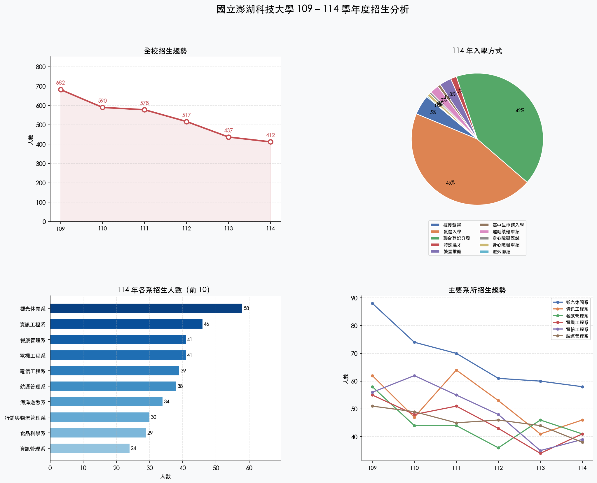

# Week 13 回家作業：招生資料視覺化分析

> 對應教材：Python3 Cookbook 第七章（函數）、第八章（類別與物件）
> 課堂參考圖：`assets/V01-bar.png`、`assets/V02-heatmap.png`、`assets/V03-dashboard.png`
> 資料來源：`assets/stu-data/109～114年新生資料庫.csv`

## 課堂範例輸出（參考風格）

| V01 各系長條圖 | V02 熱力圖 | V03 儀表板 |
|:-:|:-:|:-:|
|  |  |  |

> 作業要求你以相同風格完成不同角度的分析：Task 1 改成三年並排、Task 2 改用縣市維度。

---

## 作業目標

- 能讀取多個 CSV 檔案並整合分析
- 能用 `matplotlib` 畫出有意義的圖表
- 能從圖表中找出有趣的現象，並用文字說明
- 練習把資料處理邏輯包成函式，並撰寫 unittest

---

## 提交結構

請在 `weeks/week-13/solutions/<student-id>/` 建立以下檔案：

```text
weeks/week-13/solutions/<student-id>/
├── task1_grouped_bar.py       # Task 1：三年並排長條圖
├── task2_zipcode_heatmap.py   # Task 2：來源縣市熱力圖
├── output/                    # 程式自動產生，勿手動建立
│   ├── task1.png
│   └── task2.png
├── tests/
│   ├── test_task1.py
│   └── test_task2.py
├── TEST_LOG.md                # Red → Green 執行紀錄（必交）
├── REPORT.md                  # 資料分析心得（必交）
├── AI_USAGE.md
└── README.md
```

---

## 資料說明

CSV 路徑（從你的解題目錄往上找）：

```python
from pathlib import Path
DATA_DIR = Path(__file__).parent.parent.parent.parent / "assets" / "stu-data"
```

欄位說明：

| 欄位 | 說明 |
|------|------|
| 系所名稱 | 就讀系所 |
| 入學方式 | 甄選入學 / 聯合登記分發 / 繁星推甄 等 |
| 郵遞區號 | 學生戶籍地郵遞區號（3～5 位數字） |
| 畢業學校 | 就讀前的高中名稱 |

> 讀檔時請使用 `encoding='utf-8-sig'`（CSV 有 BOM）

---

## Task 1：三年並排長條圖（40 分）

### 參考風格

課堂 V01 是單年長條圖，Task 1 要改成三年並排：


### 任務說明

參考上方課堂範例圖，畫出比較 **112、113、114 學年度**，各系招生人數的「並排長條圖（grouped bar chart）」。

只顯示三年中任一年曾進**前 8 名**的系所。

### 預期輸出樣式

```
y 軸：各系名稱
x 軸：人數

資訊工程系  ░░░░░░░░░░ 53（112）
           ████████░░ 41（113）
           ████████░░ 46（114）

觀光休閒系  ░░░░░░░░░░ 61（112）
           ...
```

（實際輸出為 PNG 圖，文字僅供說明）

### 函式結構要求

```python
def load_year(year: int, data_dir: Path) -> dict[str, int]:
    """讀取單一年份 CSV，回傳 {系所名稱: 人數} 的 dict"""
    ...

def get_top_depts(year_data: dict[int, dict], top_n: int = 8) -> list[str]:
    """從多年資料中找出任一年曾進前 top_n 的系所清單"""
    ...
```

### 測試要求（`tests/test_task1.py`）

TDD 流程：先寫測試，再實作。至少包含：

| 測試函式 | 驗證內容 |
|---------|---------|
| `test_load_year_returns_dict` | 回傳型別為 dict，key 為字串 |
| `test_load_year_counts_correct` | 已知某系的人數正確 |
| `test_load_year_total_positive` | 總人數大於 0 |
| `test_get_top_depts_length` | 回傳數量不超過 top_n |
| `test_get_top_depts_includes_popular` | 已知熱門系所有出現在結果中 |

---

## Task 2：來源縣市熱力圖（40 分）

### 參考風格

課堂 V02 是「各系 × 年份」，Task 2 要改成「縣市 × 年份」：


### 任務說明

參考上方課堂範例圖，用**郵遞區號前 3 碼**對應縣市，畫出「縣市 × 年份」的招生人數熱力圖。

只顯示 6 年合計人數**前 10 名**的縣市。

### 郵遞區號 → 縣市對照表（可直接複製使用）

```python
ZIPCODE_TO_COUNTY = {
    "880": "澎湖縣", "881": "澎湖縣", "882": "澎湖縣", "884": "澎湖縣",
    "100": "台北市", "103": "台北市", "104": "台北市", "106": "台北市",
    "110": "台北市", "111": "台北市", "114": "台北市", "115": "台北市",
    "116": "台北市",
    "200": "基隆市", "201": "基隆市", "202": "基隆市", "203": "基隆市",
    "220": "新北市", "221": "新北市", "231": "新北市", "234": "新北市",
    "235": "新北市", "236": "新北市", "238": "新北市", "239": "新北市",
    "241": "新北市", "242": "新北市", "243": "新北市", "244": "新北市",
    "247": "新北市", "248": "新北市", "251": "新北市", "252": "新北市",
    "253": "新北市",
    "260": "宜蘭縣", "261": "宜蘭縣", "263": "宜蘭縣", "265": "宜蘭縣",
    "300": "新竹市", "302": "新竹縣", "303": "新竹縣", "304": "新竹縣",
    "305": "新竹縣", "306": "新竹縣", "307": "新竹縣", "308": "新竹縣",
    "310": "苗栗縣", "350": "苗栗縣", "351": "苗栗縣", "360": "苗栗縣",
    "400": "台中市", "401": "台中市", "402": "台中市", "403": "台中市",
    "404": "台中市", "406": "台中市", "407": "台中市", "408": "台中市",
    "411": "台中市", "412": "台中市", "413": "台中市", "420": "台中市",
    "421": "台中市", "422": "台中市", "423": "台中市", "424": "台中市",
    "426": "台中市", "427": "台中市", "428": "台中市", "429": "台中市",
    "430": "台中市", "431": "台中市", "432": "台中市", "433": "台中市",
    "434": "台中市", "435": "台中市", "436": "台中市", "437": "台中市",
    "438": "台中市", "439": "台中市",
    "500": "彰化縣", "502": "彰化縣", "503": "彰化縣", "504": "彰化縣",
    "505": "彰化縣", "506": "彰化縣", "507": "彰化縣", "508": "彰化縣",
    "509": "彰化縣", "510": "彰化縣", "511": "彰化縣", "512": "彰化縣",
    "513": "彰化縣", "514": "彰化縣", "515": "彰化縣", "516": "彰化縣",
    "520": "南投縣", "521": "南投縣", "522": "南投縣", "523": "南投縣",
    "545": "南投縣", "546": "南投縣",
    "600": "嘉義市", "602": "嘉義縣", "603": "嘉義縣", "604": "嘉義縣",
    "605": "嘉義縣",
    "630": "雲林縣", "631": "雲林縣", "632": "雲林縣", "633": "雲林縣",
    "640": "雲林縣", "641": "雲林縣",
    "700": "台南市", "701": "台南市", "702": "台南市", "703": "台南市",
    "704": "台南市", "708": "台南市", "709": "台南市", "710": "台南市",
    "711": "台南市", "712": "台南市", "713": "台南市", "714": "台南市",
    "715": "台南市", "716": "台南市", "717": "台南市", "718": "台南市",
    "719": "台南市", "720": "台南市", "721": "台南市", "722": "台南市",
    "723": "台南市", "724": "台南市", "725": "台南市", "726": "台南市",
    "730": "台南市", "731": "台南市", "732": "台南市", "733": "台南市",
    "734": "台南市", "735": "台南市", "736": "台南市",
    "800": "高雄市", "801": "高雄市", "802": "高雄市", "803": "高雄市",
    "804": "高雄市", "805": "高雄市", "806": "高雄市", "807": "高雄市",
    "811": "高雄市", "812": "高雄市", "813": "高雄市", "814": "高雄市",
    "815": "高雄市", "820": "高雄市", "821": "高雄市", "822": "高雄市",
    "823": "高雄市", "824": "高雄市", "825": "高雄市", "826": "高雄市",
    "827": "高雄市", "828": "高雄市", "829": "高雄市", "830": "高雄市",
    "831": "高雄市", "832": "高雄市", "833": "高雄市", "840": "高雄市",
    "842": "高雄市", "843": "高雄市", "844": "高雄市", "845": "高雄市",
    "846": "高雄市", "847": "高雄市",
    "900": "屏東縣", "901": "屏東縣", "902": "屏東縣", "903": "屏東縣",
    "904": "屏東縣", "905": "屏東縣", "906": "屏東縣", "907": "屏東縣",
    "908": "屏東縣", "909": "屏東縣", "911": "屏東縣", "912": "屏東縣",
    "913": "屏東縣", "920": "屏東縣", "921": "屏東縣", "922": "屏東縣",
    "923": "屏東縣", "924": "屏東縣", "925": "屏東縣", "926": "屏東縣",
    "927": "屏東縣", "928": "屏東縣", "929": "屏東縣", "931": "屏東縣",
    "932": "屏東縣", "940": "屏東縣", "941": "屏東縣", "942": "屏東縣",
    "943": "屏東縣", "944": "屏東縣", "945": "屏東縣", "946": "屏東縣",
    "947": "屏東縣", "950": "屏東縣", "951": "屏東縣", "952": "屏東縣",
    "953": "屏東縣", "954": "屏東縣", "955": "屏東縣", "956": "屏東縣",
    "957": "屏東縣", "958": "屏東縣", "966": "屏東縣",
    "950": "台東縣", "951": "台東縣", "952": "台東縣", "953": "台東縣",
    "970": "花蓮縣", "971": "花蓮縣", "972": "花蓮縣", "973": "花蓮縣",
    "974": "花蓮縣", "975": "花蓮縣", "976": "花蓮縣", "977": "花蓮縣",
    "978": "花蓮縣", "981": "花蓮縣", "983": "花蓮縣",
}

def zip_to_county(zipcode: str) -> str:
    """郵遞區號前 3 碼 → 縣市名稱，找不到回傳 '其他'"""
    return ZIPCODE_TO_COUNTY.get(zipcode[:3], "其他")
```

### 函式結構要求

```python
def load_county_counts(year: int, data_dir: Path) -> dict[str, int]:
    """讀取單一年份，回傳 {縣市: 人數} 的 dict"""
    ...

def get_top_counties(all_years: dict[int, dict], top_n: int = 10) -> list[str]:
    """6 年合計，回傳人數前 top_n 的縣市清單"""
    ...
```

### 測試要求（`tests/test_task2.py`）

| 測試函式 | 驗證內容 |
|---------|---------|
| `test_zip_to_county_penghu` | 880 → 澎湖縣 |
| `test_zip_to_county_unknown` | 未知區號 → 其他 |
| `test_load_county_counts_type` | 回傳型別為 dict |
| `test_load_county_counts_penghu_positive` | 澎湖縣人數 > 0 |
| `test_get_top_counties_length` | 回傳數量不超過 top_n |

---

## REPORT.md 內容要求（10 分）

看著你畫出的圖，回答以下三個問題（各 2～4 句）：

1. **Task 1**：哪個系三年之間人數變化最大？你認為可能的原因是什麼？
2. **Task 2**：澎湖縣學生佔全校幾成？哪個縣市排第二？有沒有出乎意料的地方？
3. **自由觀察**：從資料中，你還注意到什麼有趣的現象？

---

## 評分標準（100 分）

| 項目 | 分數 |
|------|------|
| Task 1 圖表正確（三年並排、系所正確、有圖例）| 25 分 |
| Task 1 函式結構與測試（5 個測試全過）| 15 分 |
| Task 2 圖表正確（熱力圖、縣市正確、有色條）| 25 分 |
| Task 2 函式結構與測試（5 個測試全過）| 15 分 |
| TEST_LOG.md（Red → Green 各一次）| 5 分 |
| REPORT.md（三題均有實質回答）| 10 分 |
| README.md + AI_USAGE.md 完整度 | 5 分 |

---

## 提交規範

### 分支名稱

```bash
git checkout -b submit/week-13
```

### PR 標題格式

```
Week 13 - <學號> - <姓名>
```

### 允許修改的路徑

```
weeks/week-13/solutions/<student-id>/   ← 只能動這裡
```

### 送出前檢查清單

- [ ] `git fetch upstream && git merge upstream/main` 已同步
- [ ] 目前在 `submit/week-13` 分支
- [ ] `output/task1.png` 和 `output/task2.png` 均存在
- [ ] `python -m unittest discover -s tests -p "test_*.py" -v` 全部通過
- [ ] REPORT.md 三題均已回答

參考：[`docs/SUBMISSION_GUIDE.md`](../../docs/SUBMISSION_GUIDE.md)
