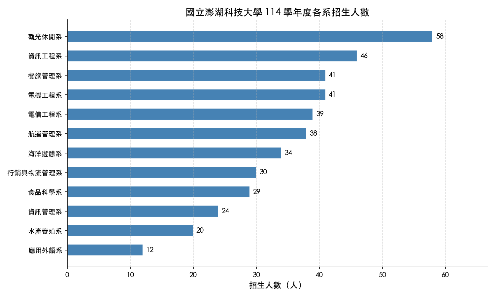
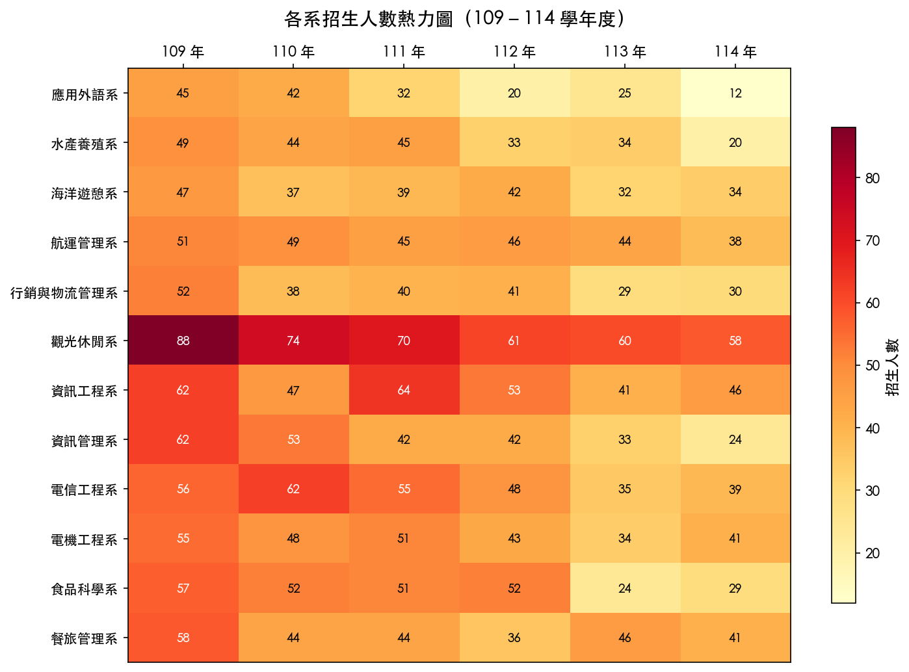

# Week 13（115/05/18－115/05/24）

- 主題：函數進階、類別設計、招生資料視覺化
- 課堂範例：[`in-class/`](./in-class/)
- 回家作業：[HOMEWORK.md](./HOMEWORK.md)

---

## 課堂範例（`in-class/`）

依 Bloom's Taxonomy 遞進，對應 Python Cookbook 第 7、8 章：

| 檔案 | 層級 | 主題 |
|------|------|------|
| [R01-function-signatures.py](./in-class/R01-function-signatures.py) | 記憶 | `*args` / `**kwargs` / keyword-only 參數 |
| [R02-special-methods.py](./in-class/R02-special-methods.py) | 記憶 | `__repr__` / `__eq__` / `@total_ordering` / `__slots__` |
| [R03-property.py](./in-class/R03-property.py) | 記憶 | `@property` getter／setter／唯讀屬性 |
| [U01-closures-traps.py](./in-class/U01-closures-traps.py) | 理解 | 可變預設值陷阱、閉包延遲綁定、`nonlocal` |
| [U02-classmethod-factory.py](./in-class/U02-classmethod-factory.py) | 理解 | `@classmethod` 多重構造器 |
| [A01-partial.py](./in-class/A01-partial.py) | 應用 | `functools.partial` 固定參數 |
| [A02-context-manager.py](./in-class/A02-context-manager.py) | 應用 | `with` 語句 / `__enter__` / `@contextmanager` |

---

## 回家作業：招生資料視覺化

使用 `assets/stu-data/` 109～114 年新生資料，完成兩張圖表分析。

### 作業預覽

| Task 1 — 三年並排長條圖 | Task 2 — 來源縣市熱力圖 |
|:-:|:-:|
|  |  |

> 圖為課堂 demo 風格參考，作業要求角度不同：Task 1 改成三年並排、Task 2 改用縣市維度。
> 詳細規格見 [HOMEWORK.md](./HOMEWORK.md)。

---

## CPE 解題清單

| # | 題名 | 核心概念 | 題目 |
|---|------|---------|------|
| 11005 | Cheapest Base | 進位制轉換、枚舉成本 | [QUESTION-11005.md](./QUESTION-11005.md) |
| 11063 | RGB → XYZ 色彩轉換 | 數學計算、格式化輸出 | [QUESTION-11063.md](./QUESTION-11063.md) |
| 11150 | 青蛙過獨木橋 | 動態規劃 | [QUESTION-11150.md](./QUESTION-11150.md) |
| 11321 | 茵可的陷阱路徑 | BFS／DFS 連通性判斷 | [QUESTION-11321.md](./QUESTION-11321.md) |
| 11332 | 平面鏡子可見性 | 計算幾何 | [QUESTION-11332.md](./QUESTION-11332.md) |

---

## AI 使用方式

### CPE 解題

1. 讀題目說明，請 AI 設計 unittest，加繁體中文註解，放到 `solutions/<學號>/tests/`
2. 請 AI 寫解題程式，跑測試，保留 LOG
3. 請 AI 加上繁體中文註解
4. 請 AI 給出更簡單易記的版本，存為 `-easy` 後綴
5. 手動把簡單版在 `solutions/<學號>/` 重新打一遍（CPE 模擬練習）

### 視覺化作業

1. 把 `assets/V01-bar.png` 給 AI，描述你要畫什麼圖
2. 請 AI 產生 matplotlib 程式碼
3. 執行、調整、確認輸出正確
4. 撰寫 REPORT.md 分析你從圖中發現的現象

---

## 提交規範

```
分支：submit/week-13
PR 標題：Week 13 - <學號> - <姓名>
提交路徑：weeks/week-13/solutions/<student-id>/
```

參考：[`docs/SUBMISSION_GUIDE.md`](../../docs/SUBMISSION_GUIDE.md)
