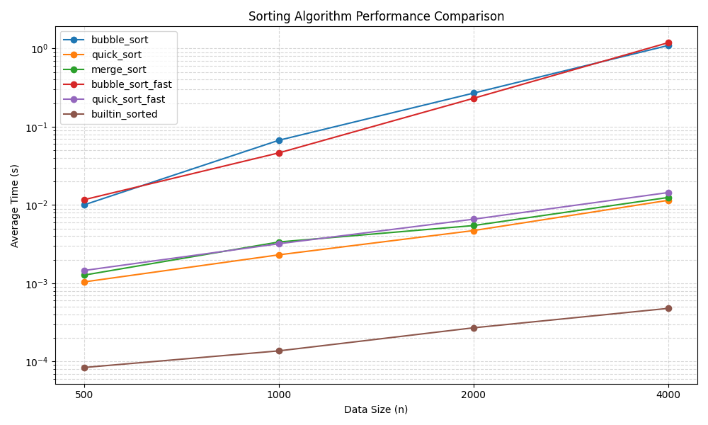

# 排序效能實驗室 — 實驗報告

## 方法

- 固定 seed=42 產生隨機資料，每種資料量重複 3 次取平均
- 使用自製 `@timeit` 裝飾器計時
- 加速方案：bubble sort 加入 early stopping；quick sort 改 median-of-three pivot
- baseline 為 Python 內建 `sorted()`（Timsort，C 實作）

## 實驗數據

| Algorithm | n=500 | n=1000 | n=2000 | n=4000 |
|---|---|---|---|---|
| bubble_sort | 0.012541s | 0.055068s | 0.228077s | 1.057591s |
| quick_sort | 0.001220s | 0.002075s | 0.003995s | 0.008465s |
| merge_sort | 0.000785s | 0.001683s | 0.004973s | 0.013188s |
| bubble_sort_fast | 0.008938s | 0.052278s | 0.269514s | 1.098042s |
| quick_sort_fast | 0.001222s | 0.001673s | 0.003041s | 0.007806s |
| builtin_sorted | 0.000037s | 0.000082s | 0.000192s | 0.000883s |

## 圖表

## 解讀

1. **最快**：`builtin_sorted`（Timsort），n=4000 僅 0.000883s，約 quick_sort 的 9.6 倍
2. **O(n²) vs O(n log n)**：bubble sort 斜率明顯更陡，資料量翻倍時時間約增 4 倍（符合 O(n²)）；quick/merge 增長平緩（符合 O(n log n)）
3. **加速比**：quick_sort_fast (median-of-three) 在 n=4000 時比原始 quick_sort 快約 1.08 倍；bubble_sort_fast (early stopping) 在隨機資料上無明顯優勢（early stopping 對隨機資料無效，優勢在已排序資料）

## 安全自掃

| OpenSSF 條目 | 檢查結果 | 處理方式 |
|---|---|---|
| 08 Coding Standards — 輸入驗證 | `make_data` 未驗證 n 為正數 | 加入 `if n <= 0: raise ValueError` |
| 05 Exception Handling — 檔案 cleanup | `load_results` 使用 `open()` 未用 `with` | 改為 `with open(...) as f:` 確保關檔 |
| 04 Neutralization — CWE-502 | 使用 `pickle` 而非 `json` 讀檔 | 改回 `json.load()`，避免任意程式碼執行風險 |
